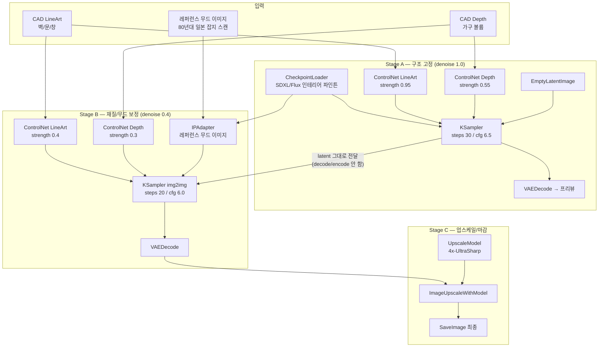

# ComfyUI 노드 워크플로우 설계 — CAD(LineArt/Depth) → 포토리얼리스틱 인테리어 렌더링 (2026-07-28)

> 006번 로그("공간 엔지니어링 아이디어")의 "다음 스텝" 항목 착수.
> 워크플로우 JSON 원본: [`docs/workflows/cad-interior-render.api.json`](../workflows/cad-interior-render.api.json)

---

## 1. 설계 원칙

CAD 도면(벽/기둥/창문/문 = LineArt, 가구 볼륨 = Depth)을 **ControlNet 뼈대로 고정**해서
디퓨전 모델이 치수/구조를 뭉개지 못하게 하고, 재질/조명/무드만 생성하게 만든다.
한 번에 다 넣지 않고 **3단계로 분리**한다 — 구조 고정 → 재질/무드 보정 → 업스케일.
이유: ControlNet weight를 처음부터 낮게 주면 구조가 무너지고, 끝까지 높게 주면 재질이 CAD처럼 납작해진다.

---

## 2. 파이프라인 다이어그램



---

## 3. 단계별 파라미터

### Stage A — 구조 고정 (Structure Lock)

| 항목 | 값 | 이유 |
|---|---|---|
| Base checkpoint | SDXL 또는 Flux 인테리어/건축 파인튠 | 실사 재질 표현력 |
| ControlNet LineArt strength | 0.90 ~ 1.0 | 벽/문/창 위치가 CAD와 1mm 단위로 일치해야 함 |
| ControlNet Depth strength | 0.50 ~ 0.60 | 가구 볼륨/비례는 지키되 재질까지 강제하진 않음 |
| Sampler | dpmpp_2m + karras | 안정적 구조 수렴 |
| Steps / CFG | 30 / 6.5 | 구조 단계라 CFG 과하게 높이지 않음(아티팩트 방지) |
| Denoise | 1.0 | EmptyLatent에서 풀 생성 |

**출력물**: 구조는 맞지만 재질이 다소 납작한 "초벌" 렌더 (프리뷰로만 저장, 최종본 아님).

### Stage B — 재질/무드 보정 (Material & Mood Refine)

| 항목 | 값 | 이유 |
|---|---|---|
| 입력 | Stage A의 **latent를 그대로 재사용** (VAE decode→encode 왕복 안 함) | 화질 손실 방지 |
| ControlNet LineArt strength | 0.35 ~ 0.45 | 구조는 Stage A가 이미 잡아놨으니 느슨하게 — 재질 표현에 여유를 줌 |
| ControlNet Depth strength | 0.25 ~ 0.35 | 동일 이유 |
| IPAdapter | 80년대 일본 잡지 레퍼런스 이미지 | 006번 로그의 "고밀도 수납/무드 패턴"을 텍스트 프롬프트가 아니라 **이미지로 직접 이식** — 재질/색감/조명 무드 전이 |
| Sampler | dpmpp_2m + karras | Stage A와 동일 계열(latent 연속성) |
| Steps / CFG | 20 / 6.0 | refine 단계라 스텝 줄임 |
| Denoise | 0.35 ~ 0.45 | 구조 보존 + 재질/조명 자유도의 스윗스팟 |

**출력물**: 실사 재질 + 80s 일본 무드가 입혀진 최종 구도. 이게 사실상 "완성본".

### Stage C — 업스케일/마감

| 항목 | 값 | 이유 |
|---|---|---|
| Upscale model | 4x-UltraSharp (ESRGAN 계열) | 건축 렌더에서 라인/텍스처 보존이 좋은 범용 모델 |
| 방식 | ImageUpscaleWithModel (단순 업스케일) | 커스텀 노드(Ultimate SD Upscale) 없이도 동작하는 최소 구성 |
| 선택 확장 | Ultimate SD Upscale로 교체 시 타일 단위 재샘플링 → 디테일 한 단계 더 상승 (ComfyUI-Manager로 커스텀 노드 설치 필요) |

---

## 4. 노드 의존성 (설치 필요 목록)

| 노드 | 종류 | 비고 |
|---|---|---|
| CheckpointLoaderSimple, CLIPTextEncode, ControlNetLoader, ControlNetApplyAdvanced, KSampler, VAEDecode, EmptyLatentImage, LoadImage, SaveImage, UpscaleModelLoader, ImageUpscaleWithModel | **내장(built-in)** | ComfyUI 기본 설치만으로 동작 |
| IPAdapterUnifiedLoader, IPAdapterAdvanced | **커스텀** | `ComfyUI_IPAdapter_plus` — ComfyUI-Manager로 설치 |
| LoraLoader | 내장 (선택) | 80s 일본 인테리어 스타일 LoRA를 직접 학습시켰을 경우에만 사용 |

체크포인트/컨트롤넷 모델 파일(예: `sd_xl_base_1.0.safetensors`, `control-lora-lineart-rank256.safetensors`, `control-lora-depth-rank256.safetensors`, `4x-UltraSharp.pth`)은 워크플로우 JSON 안에 **플레이스홀더 파일명**으로 넣어뒀다. 실제 실행 전 Vast.ai 인스턴스의 `ComfyUI/models/` 하위 실제 파일명으로 교체해야 한다.

---

## 5. 실행 방법 (Vast.ai 기준)

로컬 GPU 없음 — 글로벌 규칙(`~/.claude/CLAUDE.md`)에 따라 Vast.ai RTX 4090 인스턴스에서
`ComfyUI --listen 0.0.0.0` (API 모드)로 띄운 뒤, 이 워크플로우 JSON을 `/prompt` 엔드포인트에 그대로 POST한다.

```bash
curl -X POST http://<vast-ai-ip>:8188/prompt \
  -H "Content-Type: application/json" \
  -d @docs/workflows/cad-interior-render.api.json
```

입력 이미지(`cad_lineart.png`, `cad_depth.png`, `mood_reference.jpg`)는 사전에
ComfyUI `input/` 폴더로 업로드(`/upload/image` 엔드포인트 또는 SCP)해야 파일명 참조가 풀린다.

---

## 6. 미결정/다음 단계

- 006번 로그의 "AI Core: Spatial Parser"(사진→CAD LineArt/Depth 변환) 자체는 아직 미설계 — 이 워크플로우는 그 출력물이 이미 있다고 가정하고 후반부(CAD→렌더링)만 다룸
- 80s 일본 잡지 레퍼런스 이미지 아카이브 및 태그 체계는 006번 로그에서도 미착수 상태
- LoRA 파인튜닝 여부는 IPAdapter 레퍼런스 이미지 방식으로 먼저 검증 후 결정 (재학습 비용 회피)
